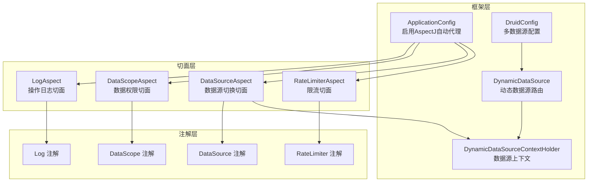
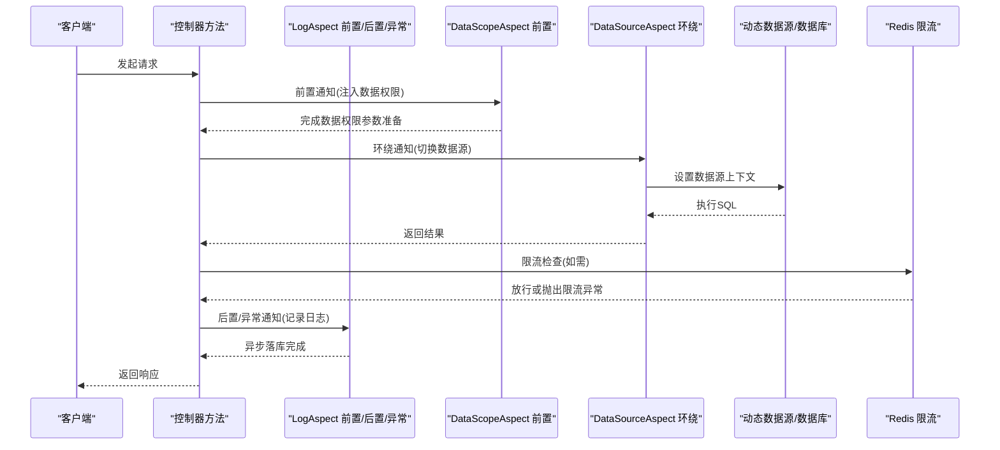
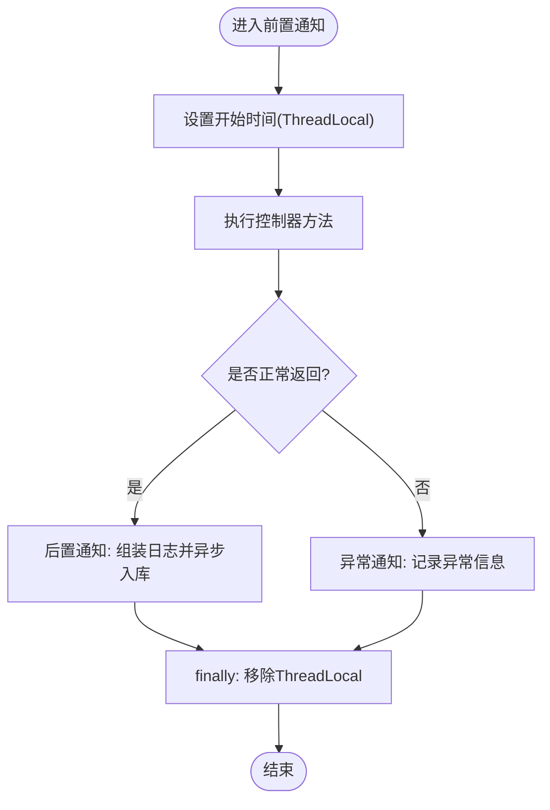
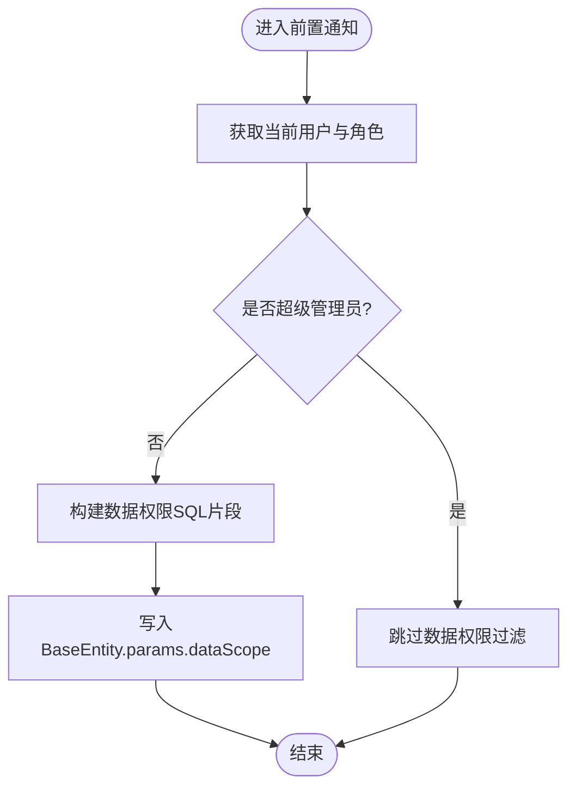
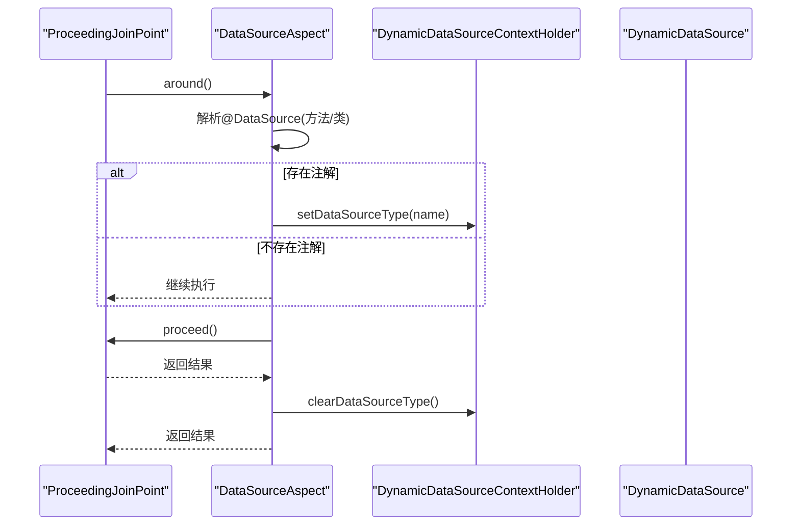
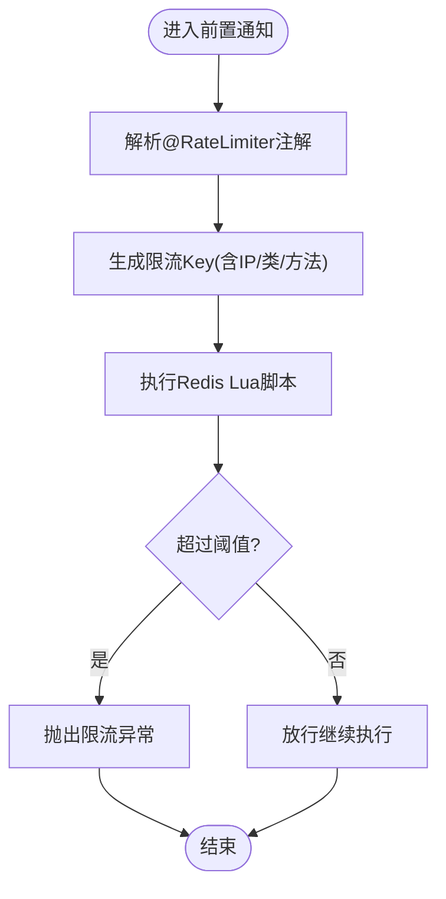
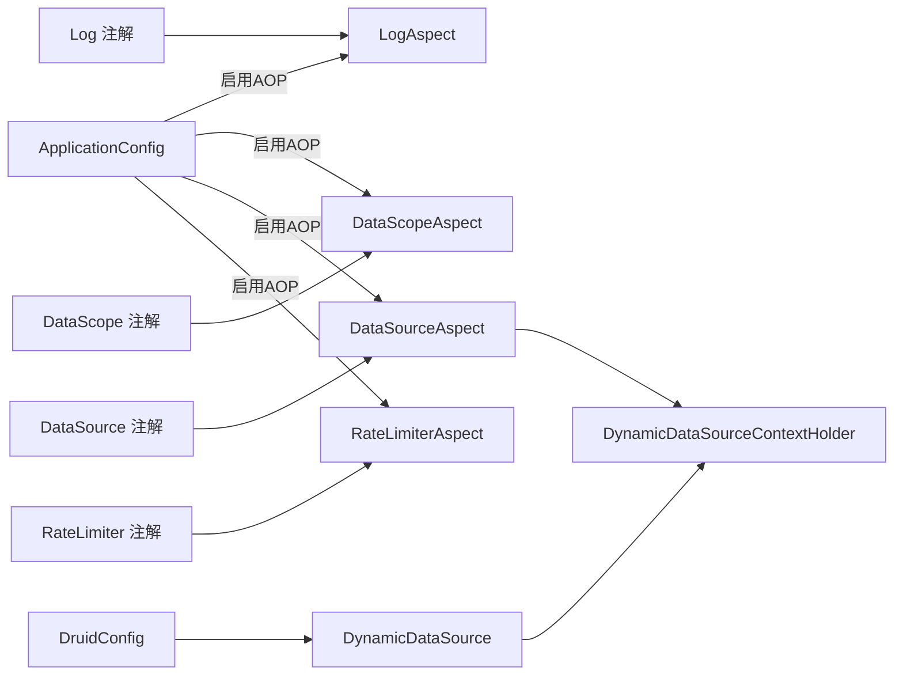

# AOP切面开发

<cite>
**本文引用的文件列表**
- [LogAspect.java](file://ruoyi-framework/src/main/java/com/ruoyi/framework/aspectj/LogAspect.java)
- [DataScopeAspect.java](file://ruoyi-framework/src/main/java/com/ruoyi/framework/aspectj/DataScopeAspect.java)
- [DataSourceAspect.java](file://ruoyi-framework/src/main/java/com/ruoyi/framework/aspectj/DataSourceAspect.java)
- [RateLimiterAspect.java](file://ruoyi-framework/src/main/java/com/ruoyi/framework/aspectj/RateLimiterAspect.java)
- [Log.java](file://ruoyi-common/src/main/java/com/ruoyi/common/annotation/Log.java)
- [DataScope.java](file://ruoyi-common/src/main/java/com/ruoyi/common/annotation/DataScope.java)
- [DataSource.java](file://ruoyi-common/src/main/java/com/ruoyi/common/annotation/DataSource.java)
- [RateLimiter.java](file://ruoyi-common/src/main/java/com/ruoyi/common/annotation/RateLimiter.java)
- [ApplicationConfig.java](file://ruoyi-framework/src/main/java/com/ruoyi/framework/config/ApplicationConfig.java)
- [DynamicDataSource.java](file://ruoyi-framework/src/main/java/com/ruoyi/framework/datasource/DynamicDataSource.java)
- [DynamicDataSourceContextHolder.java](file://ruoyi-framework/src/main/java/com/ruoyi/framework/datasource/DynamicDataSourceContextHolder.java)
- [DruidConfig.java](file://ruoyi-framework/src/main/java/com/ruoyi/framework/config/DruidConfig.java)
- [RuoYiApplication.java](file://ruoyi-admin/src/main/java/com/ruoyi/RuoYiApplication.java)
- [SpringUtils.java](file://ruoyi-common/src/main/java/com/ruoyi/common/utils/spring/SpringUtils.java)
</cite>

## 目录
1. [引言](#引言)
2. [项目结构](#项目结构)
3. [核心组件](#核心组件)
4. [架构总览](#架构总览)
5. [详细组件分析](#详细组件分析)
6. [依赖关系分析](#依赖关系分析)
7. [性能考量](#性能考量)
8. [故障排查指南](#故障排查指南)
9. [结论](#结论)
10. [附录](#附录)

## 引言
本技术文档围绕 RuoYi-Vue 的 AOP 切面开发进行系统化梳理，重点讲解 AspectJ 在项目中的落地与实践，涵盖以下核心切面：
- 操作日志切面：LogAspect
- 数据权限切面：DataScopeAspect
- 数据源切换切面：DataSourceAspect
- 限流切面：RateLimiterAspect

文档将从架构视角出发，结合通知类型、JoinPoint 使用、生命周期管理、优先级控制、异常处理与性能优化等方面，帮助读者快速掌握在该工程中开发与扩展 AOP 切面的方法论。

## 项目结构
RuoYi-Vue 将 AOP 切面集中于 framework 模块的 aspectj 包中，配合注解定义位于 common 模块的 annotation 包，以及动态数据源相关组件位于 framework 的 datasource 包。AOP 自动代理由 framework 的 ApplicationConfig 启用。

图表来源
- [ApplicationConfig.java](file://ruoyi-framework/src/main/java/com/ruoyi/framework/config/ApplicationConfig.java#L16-L17)
- [LogAspect.java](file://ruoyi-framework/src/main/java/com/ruoyi/framework/aspectj/LogAspect.java#L41-L43)
- [DataScopeAspect.java](file://ruoyi-framework/src/main/java/com/ruoyi/framework/aspectj/DataScopeAspect.java#L25-L27)
- [DataSourceAspect.java](file://ruoyi-framework/src/main/java/com/ruoyi/framework/aspectj/DataSourceAspect.java#L23-L26)
- [RateLimiterAspect.java](file://ruoyi-framework/src/main/java/com/ruoyi/framework/aspectj/RateLimiterAspect.java#L27-L29)
- [DynamicDataSource.java](file://ruoyi-framework/src/main/java/com/ruoyi/framework/datasource/DynamicDataSource.java#L12-L26)
- [DynamicDataSourceContextHolder.java](file://ruoyi-framework/src/main/java/com/ruoyi/framework/datasource/DynamicDataSourceContextHolder.java#L11-L45)
- [DruidConfig.java](file://ruoyi-framework/src/main/java/com/ruoyi/framework/config/DruidConfig.java#L52-L60)

章节来源
- [ApplicationConfig.java](file://ruoyi-framework/src/main/java/com/ruoyi/framework/config/ApplicationConfig.java#L16-L17)
- [RuoYiApplication.java](file://ruoyi-admin/src/main/java/com/ruoyi/RuoYiApplication.java#L14-L14)

## 核心组件
- LogAspect：基于注解拦截控制器方法，记录操作日志，支持请求/响应参数保存、异常捕获、耗时统计与异步落库。
- DataScopeAspect：在方法执行前注入数据权限 SQL 片段，依据用户角色与权限字符生成过滤条件，写入 BaseParams。
- DataSourceAspect：环绕通知切换动态数据源，支持方法级与类级注解，保证 finally 中清理上下文。
- RateLimiterAspect：基于 Redis 的 Lua 限流脚本实现请求频率控制，支持多种限流粒度。

章节来源
- [LogAspect.java](file://ruoyi-framework/src/main/java/com/ruoyi/framework/aspectj/LogAspect.java#L41-L137)
- [DataScopeAspect.java](file://ruoyi-framework/src/main/java/com/ruoyi/framework/aspectj/DataScopeAspect.java#L25-L184)
- [DataSourceAspect.java](file://ruoyi-framework/src/main/java/com/ruoyi/framework/aspectj/DataSourceAspect.java#L23-L72)
- [RateLimiterAspect.java](file://ruoyi-framework/src/main/java/com/ruoyi/framework/aspectj/RateLimiterAspect.java#L27-L90)

## 架构总览
下图展示了 AOP 切面在请求生命周期中的执行顺序与职责分工，以及与动态数据源、异步任务、Redis 限流的关系。

图表来源
- [LogAspect.java](file://ruoyi-framework/src/main/java/com/ruoyi/framework/aspectj/LogAspect.java#L56-L83)
- [DataScopeAspect.java](file://ruoyi-framework/src/main/java/com/ruoyi/framework/aspectj/DataScopeAspect.java#L59-L80)
- [DataSourceAspect.java](file://ruoyi-framework/src/main/java/com/ruoyi/framework/aspectj/DataSourceAspect.java#L37-L56)
- [RateLimiterAspect.java](file://ruoyi-framework/src/main/java/com/ruoyi/framework/aspectj/RateLimiterAspect.java#L49-L74)

## 详细组件分析

### LogAspect 操作日志切面
- 通知类型与使用场景
  - 前置通知：记录开始时间，便于计算耗时。
  - 后置通知：在方法正常返回时记录日志并异步入库。
  - 异常通知：在方法抛出异常时记录失败原因与异常消息。
- 关键实现要点
  - 使用注解驱动的切入点，拦截带 Log 注解的方法。
  - 通过安全工具获取登录用户信息，填充操作人、部门等字段。
  - 通过 Servlet 工具获取请求 URL、IP、请求方式等。
  - 可选择保存请求参数与响应结果，敏感字段与文件类型自动过滤。
  - 使用异步管理器异步入库，避免阻塞主流程。
- JoinPoint 使用
  - 获取目标类名与方法签名，构造方法全限定名。
  - 获取请求参数 Map 或参数数组，按请求方法与注解配置决定序列化策略。
  - 过滤 MultipartFile、HttpServletRequest、HttpServletResponse、BindingResult 等对象，避免日志膨胀与敏感信息泄露。
- 生命周期管理
  - 使用 ThreadLocal 记录开始时间，在 finally 中移除，避免内存泄漏。
  - 异常捕获与日志输出，保证日志记录的健壮性。

图表来源
- [LogAspect.java](file://ruoyi-framework/src/main/java/com/ruoyi/framework/aspectj/LogAspect.java#L56-L137)

章节来源
- [LogAspect.java](file://ruoyi-framework/src/main/java/com/ruoyi/framework/aspectj/LogAspect.java#L41-L137)
- [Log.java](file://ruoyi-common/src/main/java/com/ruoyi/common/annotation/Log.java#L17-L51)

### DataScopeAspect 数据权限切面
- 通知类型与使用场景
  - 前置通知：在方法执行前注入数据权限过滤条件。
- 关键实现要点
  - 通过安全上下文获取当前用户与角色，判断是否超级管理员。
  - 依据角色的数据范围策略（全部、自定义、部门、部门及子级、仅本人）拼接 SQL 片段。
  - 支持多角色组合与权限字符匹配，避免重复拼接。
  - 将最终 SQL 片段写入 BaseEntity 的 params 中，供后续 MyBatis 查询使用。
  - 提供清理方法，防止历史数据污染。
- JoinPoint 使用
  - 通过参数列表定位首个实体参数，读取并写入 params。
- 生命周期管理
  - 在前置阶段清理旧值，确保每次调用都基于最新上下文。

图表来源
- [DataScopeAspect.java](file://ruoyi-framework/src/main/java/com/ruoyi/framework/aspectj/DataScopeAspect.java#L59-L184)

章节来源
- [DataScopeAspect.java](file://ruoyi-framework/src/main/java/com/ruoyi/framework/aspectj/DataScopeAspect.java#L25-L184)
- [DataScope.java](file://ruoyi-common/src/main/java/com/ruoyi/common/annotation/DataScope.java#L14-L33)

### DataSourceAspect 数据源切换切面
- 通知类型与使用场景
  - 环绕通知：在目标方法执行前后切换与清理数据源上下文。
- 关键实现要点
  - 切入点同时支持方法与类上的注解，优先取方法注解，其次类注解。
  - 通过注解解析器获取注解值，设置到动态数据源上下文。
  - finally 中清理上下文，避免线程复用导致的数据源泄漏。
  - 通过 @Order(1) 控制优先级，确保在其他切面之前生效。
- JoinPoint 使用
  - 使用 ProceedingJoinPoint.proceed() 执行目标方法。
  - 使用 MethodSignature 获取方法与声明类型，辅助注解解析。
- 生命周期管理
  - set → proceed → clear 的严格顺序，保证作用域最小化。

图表来源
- [DataSourceAspect.java](file://ruoyi-framework/src/main/java/com/ruoyi/framework/aspectj/DataSourceAspect.java#L37-L72)
- [DynamicDataSourceContextHolder.java](file://ruoyi-framework/src/main/java/com/ruoyi/framework/datasource/DynamicDataSourceContextHolder.java#L24-L44)
- [DynamicDataSource.java](file://ruoyi-framework/src/main/java/com/ruoyi/framework/datasource/DynamicDataSource.java#L21-L25)

章节来源
- [DataSourceAspect.java](file://ruoyi-framework/src/main/java/com/ruoyi/framework/aspectj/DataSourceAspect.java#L23-L72)
- [DataSource.java](file://ruoyi-common/src/main/java/com/ruoyi/common/annotation/DataSource.java#L14-L28)
- [DruidConfig.java](file://ruoyi-framework/src/main/java/com/ruoyi/framework/config/DruidConfig.java#L52-L60)

### RateLimiterAspect 限流切面
- 通知类型与使用场景
  - 前置通知：在方法执行前进行限流判断。
- 关键实现要点
  - 基于 Redis 的 Lua 脚本原子计数，支持固定窗口与滑动窗口策略。
  - 限流 key 支持自定义与 IP 维度组合，方法维度唯一。
  - 限流阈值与时间窗口可配置，异常统一抛出业务异常。
- JoinPoint 使用
  - 通过 MethodSignature 获取方法签名，结合类名与方法名生成唯一 key。
- 生命周期管理
  - 限流逻辑在前置阶段完成，不影响目标方法执行（若未触发异常）。

图表来源
- [RateLimiterAspect.java](file://ruoyi-framework/src/main/java/com/ruoyi/framework/aspectj/RateLimiterAspect.java#L49-L88)

章节来源
- [RateLimiterAspect.java](file://ruoyi-framework/src/main/java/com/ruoyi/framework/aspectj/RateLimiterAspect.java#L27-L90)
- [RateLimiter.java](file://ruoyi-common/src/main/java/com/ruoyi/common/annotation/RateLimiter.java#L16-L40)

## 依赖关系分析
- AOP 启用与暴露代理
  - ApplicationConfig 启用 AspectJ 自动代理并暴露代理对象，便于同进程内调用自身方法时获取代理行为。
- 注解与枚举
  - Log、DataScope、DataSource、RateLimiter 注解定义了切面的切入点与行为参数。
  - DataSourceType 枚举定义了数据源类型（MASTER/SLAVE）。
- 动态数据源
  - DruidConfig 构建多数据源并注册为动态数据源 Bean。
  - DynamicDataSource 作为路由实现，依据上下文选择数据源。
  - DynamicDataSourceContextHolder 通过 ThreadLocal 维护当前线程的数据源键。

图表来源
- [ApplicationConfig.java](file://ruoyi-framework/src/main/java/com/ruoyi/framework/config/ApplicationConfig.java#L16-L17)
- [DataSourceAspect.java](file://ruoyi-framework/src/main/java/com/ruoyi/framework/aspectj/DataSourceAspect.java#L23-L26)
- [DynamicDataSource.java](file://ruoyi-framework/src/main/java/com/ruoyi/framework/datasource/DynamicDataSource.java#L12-L26)
- [DynamicDataSourceContextHolder.java](file://ruoyi-framework/src/main/java/com/ruoyi/framework/datasource/DynamicDataSourceContextHolder.java#L11-L45)
- [DruidConfig.java](file://ruoyi-framework/src/main/java/com/ruoyi/framework/config/DruidConfig.java#L52-L60)

章节来源
- [ApplicationConfig.java](file://ruoyi-framework/src/main/java/com/ruoyi/framework/config/ApplicationConfig.java#L16-L17)
- [DataSource.java](file://ruoyi-common/src/main/java/com/ruoyi/common/annotation/DataSource.java#L14-L28)
- [DruidConfig.java](file://ruoyi-framework/src/main/java/com/ruoyi/framework/config/DruidConfig.java#L52-L60)

## 性能考量
- 异步日志
  - 操作日志采用异步入库，避免阻塞请求主线程，降低尾延迟波动。
- 轻量参数序列化
  - 对请求参数与响应结果进行敏感字段排除与对象过滤，减少序列化开销与日志体积。
- 限流脚本原子化
  - Redis Lua 脚本保证计数与比较的原子性，降低竞争条件带来的额外开销。
- 数据权限拼接优化
  - 多角色合并与去重，避免重复 SQL 片段拼接，提升 SQL 可读性与执行效率。
- 数据源切换最小化
  - 环绕通知仅在必要时设置上下文并在 finally 清理，避免线程污染。

## 故障排查指南
- 切面未生效
  - 确认 ApplicationConfig 已启用 @EnableAspectJAutoProxy(exposeProxy = true)，且切面类被 Spring 管理（@Component）。
  - 确认目标方法所在包已被扫描（@MapperScan 或 @ComponentScan 覆盖）。
- 数据源切换无效
  - 检查注解是否放置在方法或类上，确认注解值与枚举一致。
  - 确认 DynamicDataSource 已注册为主数据源，且上下文在 finally 中被清理。
- 数据权限未生效
  - 检查 BaseEntity 的 params 中 dataScope 字段是否被正确写入。
  - 确认角色数据范围与权限字符匹配，避免因权限不足导致条件为空。
- 限流异常
  - 检查 Redis 连通性与 Lua 脚本可用性。
  - 核对限流 key 组合是否唯一，避免不同接口共享相同 key。
- 日志记录异常
  - 检查异步线程池配置与队列容量，避免日志丢失。
  - 关注敏感字段排除与过滤逻辑，避免误删关键信息。

章节来源
- [ApplicationConfig.java](file://ruoyi-framework/src/main/java/com/ruoyi/framework/config/ApplicationConfig.java#L16-L17)
- [DataSourceAspect.java](file://ruoyi-framework/src/main/java/com/ruoyi/framework/aspectj/DataSourceAspect.java#L23-L72)
- [DataScopeAspect.java](file://ruoyi-framework/src/main/java/com/ruoyi/framework/aspectj/DataScopeAspect.java#L59-L184)
- [RateLimiterAspect.java](file://ruoyi-framework/src/main/java/com/ruoyi/framework/aspectj/RateLimiterAspect.java#L49-L88)
- [LogAspect.java](file://ruoyi-framework/src/main/java/com/ruoyi/framework/aspectj/LogAspect.java#L85-L137)

## 结论
RuoYi-Vue 的 AOP 切面体系以注解为核心，结合 AspectJ 的多种通知类型与 Spring 的自动代理机制，实现了日志、权限、数据源与限流等横切能力。通过合理的生命周期管理、参数过滤与异步化策略，既保证了功能的完整性，也兼顾了性能与稳定性。开发者可参考现有切面模式，快速扩展新的业务切面。

## 附录

### 通知类型与典型使用场景对照
- 前置通知（@Before）
  - 适用：参数校验、鉴权、数据权限注入、限流预检。
  - 示例：DataScopeAspect、RateLimiterAspect。
- 后置通知（@AfterReturning）
  - 适用：正常返回后的日志记录、响应结果保存。
  - 示例：LogAspect。
- 异常通知（@AfterThrowing）
  - 适用：异常捕获与日志记录。
  - 示例：LogAspect。
- 环绕通知（@Around）
  - 适用：资源切换、事务控制、性能监控。
  - 示例：DataSourceAspect。

章节来源
- [LogAspect.java](file://ruoyi-framework/src/main/java/com/ruoyi/framework/aspectj/LogAspect.java#L56-L83)
- [DataScopeAspect.java](file://ruoyi-framework/src/main/java/com/ruoyi/framework/aspectj/DataScopeAspect.java#L59-L80)
- [DataSourceAspect.java](file://ruoyi-framework/src/main/java/com/ruoyi/framework/aspectj/DataSourceAspect.java#L37-L56)
- [RateLimiterAspect.java](file://ruoyi-framework/src/main/java/com/ruoyi/framework/aspectj/RateLimiterAspect.java#L49-L74)

### JoinPoint 使用最佳实践
- 获取目标方法签名与类名，构造方法全限定名，便于日志与审计。
- 对请求参数进行序列化时，优先使用请求体参数，其次使用参数数组，并进行敏感字段排除。
- 过滤大对象（如文件、请求/响应包装器、绑定结果），避免日志膨胀与序列化异常。
- 在 finally 中清理 ThreadLocal，避免线程复用导致的状态残留。

章节来源
- [LogAspect.java](file://ruoyi-framework/src/main/java/com/ruoyi/framework/aspectj/LogAspect.java#L114-L186)
- [LogAspect.java](file://ruoyi-framework/src/main/java/com/ruoyi/framework/aspectj/LogAspect.java#L217-L255)

### 切面优先级与执行顺序
- 通过 @Order 控制多个切面对同一连接点的执行顺序。
- DataSourceAspect 使用 @Order(1) 保证在其他切面之前生效，确保数据源切换的正确性。
- 建议：将资源切换类切面（如数据源、事务）置于较高优先级，业务切面（日志、限流）置于较低优先级。

章节来源
- [DataSourceAspect.java](file://ruoyi-framework/src/main/java/com/ruoyi/framework/aspectj/DataSourceAspect.java#L24-L24)

### 自定义切面开发步骤（基于现有模式）
- 定义注解
  - 参考现有注解的元注解与属性设计，明确切入点与行为参数。
  - 示例：[Log.java](file://ruoyi-common/src/main/java/com/ruoyi/common/annotation/Log.java#L17-L51)、[DataScope.java](file://ruoyi-common/src/main/java/com/ruoyi/common/annotation/DataScope.java#L14-L33)、[DataSource.java](file://ruoyi-common/src/main/java/com/ruoyi/common/annotation/DataSource.java#L14-L28)、[RateLimiter.java](file://ruoyi-common/src/main/java/com/ruoyi/common/annotation/RateLimiter.java#L16-L40)。
- 编写切面
  - 选择合适的通知类型，编写前置/后置/异常/环绕逻辑。
  - 使用 JoinPoint 获取目标信息与参数，注意敏感字段过滤与对象类型判断。
  - 在 finally 中进行必要的清理工作。
- 注册与测试
  - 确保切面类被 Spring 管理（@Component），并处于扫描范围内。
  - 在目标方法上添加注解进行验证，关注日志与异常输出。
- 性能与健壮性
  - 异步化非关键路径（如日志、监控）。
  - 使用 ThreadLocal 时务必清理，避免内存泄漏。
  - 对外部依赖（Redis、数据库）增加超时与降级策略。

章节来源
- [LogAspect.java](file://ruoyi-framework/src/main/java/com/ruoyi/framework/aspectj/LogAspect.java#L56-L137)
- [DataScopeAspect.java](file://ruoyi-framework/src/main/java/com/ruoyi/framework/aspectj/DataScopeAspect.java#L59-L184)
- [DataSourceAspect.java](file://ruoyi-framework/src/main/java/com/ruoyi/framework/aspectj/DataSourceAspect.java#L37-L72)
- [RateLimiterAspect.java](file://ruoyi-framework/src/main/java/com/ruoyi/framework/aspectj/RateLimiterAspect.java#L49-L88)